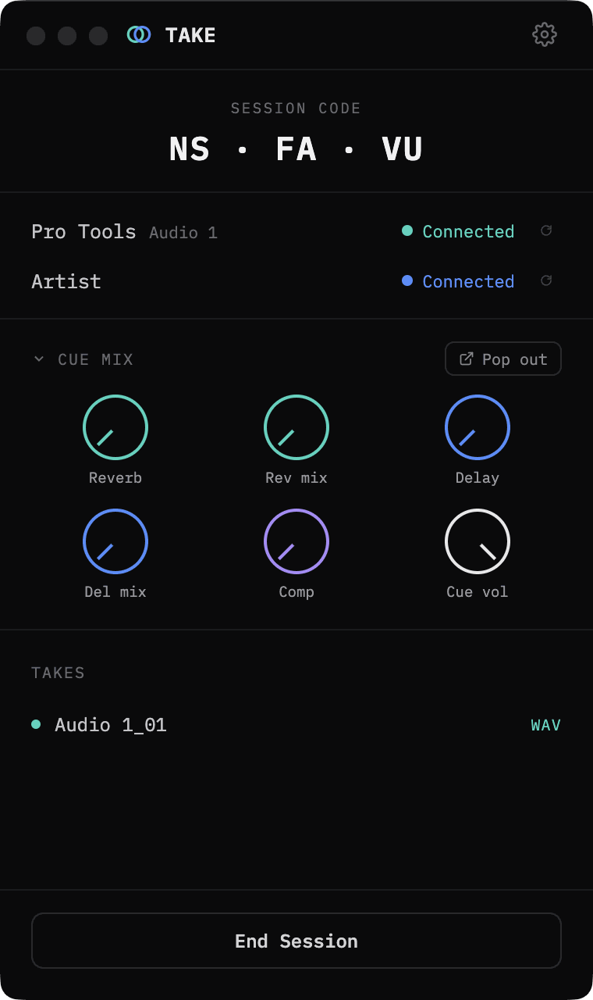
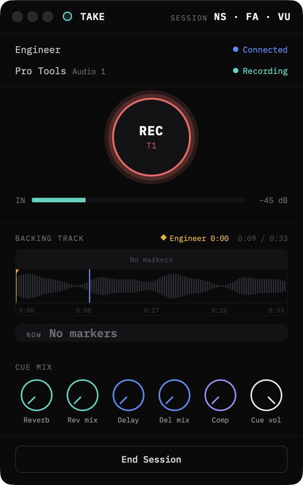

# Take

Take is a remote recording session tool that lets an engineer and an artist work together from different locations. The engineer controls transport and cue mix from a web app, while the artist monitors session state and meters in a native macOS app. Recording is captured losslessly on the artist's machine and the takes are transferred back to the engineer, with Reaper driving the actual capture.

## Screenshots

> _Screenshots coming soon._
>
> <!-- Add images here, e.g.:
> 
>  -->

## Project layout

```
Take/
├── artist-app/    Native macOS app the artist runs (JUCE / C++, Xcode project)
├── engineer-app/  Web UI the engineer runs (Electron + React + Vite)
├── backend/       Python services for BOTH sides (transport, relay, file transfer, Reaper)
├── recordings/    Artist's local lossless takes (written by backend, git-ignored)
├── incoming/      Files the engineer receives from the artist (git-ignored)
├── docs/          Product spec and design docs
├── PORTS.md       Full port map for the running services
└── README.md
```

A session uses all three apps together: the artist runs `artist-app` + the
artist half of `backend`; the engineer runs `engineer-app` + the engineer half
of `backend`. The two halves of `backend` share modules (file transfer, Reaper
control, timecode), which is why they live in one Python folder.

## Requirements

- macOS with Python 3.9 at `/usr/bin/python3` (standard on older Macs), or install Python 3.11 and adjust the scripts
- **Python 3.13+ is not supported** — `pedalboard` requires Python ≤ 3.12
- Node.js 18+
- Reaper (with web interface enabled)

## Setup

### 1. Clone the repo

```bash
git clone <repo-url>
cd Take
```

### 2. Backend (Python services)

```bash
cd backend
./setup.sh
```

This installs all dependencies directly to `/usr/bin/python3`.

### 3. Engineer web app

```bash
cd engineer-app
npm install
```

## Running

### One-click launch (recommended)

Double-click **Take Engineer.app** — this opens a terminal window running
the Python backend and the Electron engineer app together.

Double-click **Take Artist.app** — this opens a terminal window running
the Python backend and the JUCE artist app together.

Start the engineer app first and wait for the session code to appear,
then start the artist app.

### Manual launch (for development)

**Engineer:**
```bash
# Terminal 1 — Python services
cd backend
./dev_engineer.sh

# Terminal 2 — React dev server
cd engineer-app
npm run start
```

**Artist:**
```bash
cd backend
./dev_artist.sh
```

### Two machines

The relay (port 5010) runs on the engineer's machine. The artist's backend finds it via the session file written by the Take app, or you can point it there explicitly:

```bash
TAKE_RELAY_HOST=<engineer-ip> ./dev_artist.sh
```

Both machines must be reachable on ports 5001–5010 (same LAN or VPN). See [PORTS.md](PORTS.md) for the full port map; each startup script checks its ports and reports conflicts instead of failing silently.

## Reaper setup

1. Enable the web interface: **Preferences → Control/OSC/web → Add → Web browser interface** (port 8080)
2. Run `backend/setup.sh` — it installs `take_session.lua` plus an auto-start hook (`Scripts/__startup.lua`). Every Reaper launch then automatically:
   - listens for Take's transport commands (record/stop/RTZ/swap)
   - keeps track and marker exports current — no manual script runs needed
   - self-registers the insert action — no command-ID copying needed

After that, a session is: open Reaper, double-click Take Engineer.app, and pick a destination track in the engineer app. Take is minimally invasive in Reaper: it never changes track inputs or routing, and only arms the selected track at the moment recording starts. Set the destination track's input (e.g. BlackHole for the live artist stream) yourself, once, as part of your project template.

## Built with

- **[JUCE](https://juce.com/)** — native macOS artist app (C++)
- **[Electron](https://www.electronjs.org/)** — engineer desktop web app (with React + Vite)
- **[Python](https://www.python.org/)** — backend services for transport, relay, file transfer, and timecode
- **[Reaper](https://www.reaper.fm/)** — DAW driving the lossless recording via its web interface

## License

Released under the [MIT License](LICENSE). Copyright (c) 2026 Arda Akıncı.
